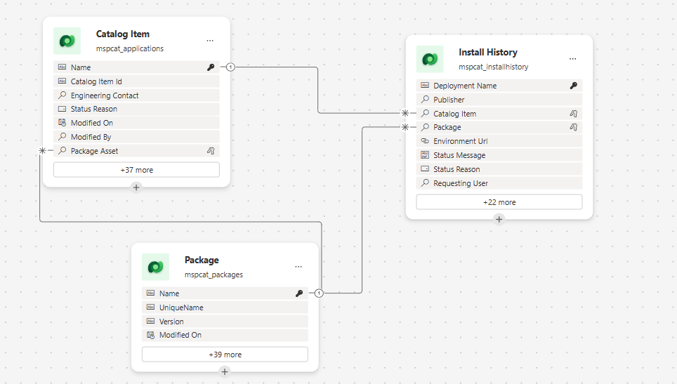
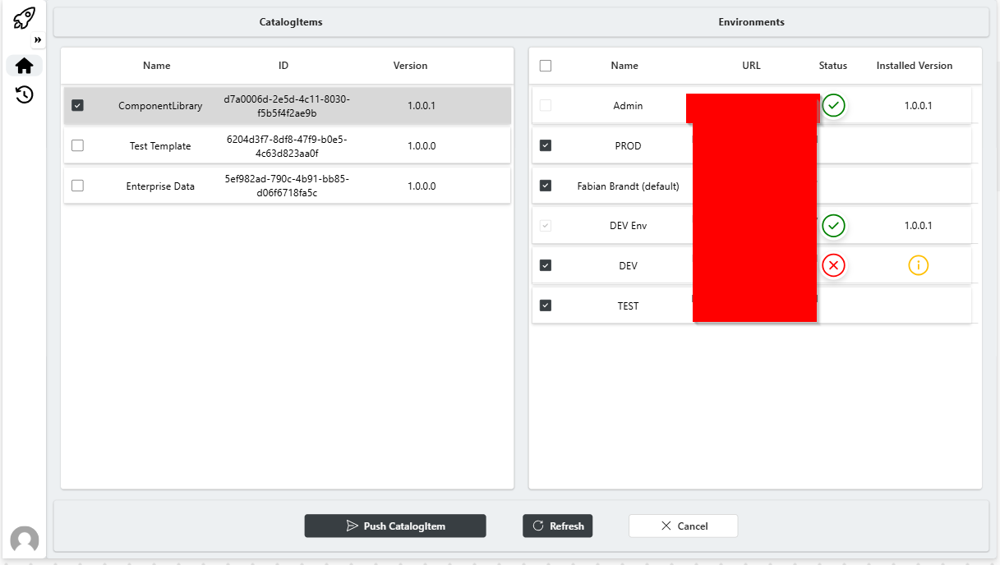

# Centralized Catalog Item Deployer for Multi-Environment Rollouts

As organizations grow and scale their **Microsoft Power Platform** estates, administrators face recurring challenges when deploying solutions (Catalog Items) across many **Dataverse environments**. The standard manual process of exporting and importing solutions is error-prone, time-consuming, and offers limited transparency into version status and failure reasons. 

This solution—**Centralized Catalog Item Deployer**—provides a more efficient, consistent and auditable way to deploy Power Platform Catalog Items across multiple environments. 

🔗 **LinkedIn post:**  
[LinkedIn-Post](https://www.linkedin.com/pulse/centralized-catalog-item-deployer-multi-environment-rollouts-brandt-2ykpe/ )

---

## 🧠 The Challenge

When working in environments with many deployments—such as Dev, Test, QA, and Production—administrators often struggle with:

- manual import/export steps that take time and introduce human error  
- no consistent way to deploy the same version everywhere  
- poor visibility into which version is installed where

These issues make deployment difficult to scale and hard to govern reliably.

---

## 🛠️ What the Deployer Does

The **Centralized Catalog Item Deployer** is a combined **Canvas App + Power Automate Flow** that simplifies multi-environment rollouts:

- Uses the **Power Platform Catalog** tables (Items, Packages, Install Histories) as a foundation  
- Retrieves *live environments* via the **Power Platform for Admins connector**  
- Allows **one-click deployments** to multiple target environments using the Dataverse Web API  
- Provides per-environment feedback (success ✔️, error ❌)  
- Automatically logs deployment results for auditing and troubleshooting

---

## 🔌 Solution Architecture

The deployer consists of two main parts:

### 🗄️ Dataverse Data Model

The solution is built on top of the standard **Power Platform Catalog** tables, extended with
additional metadata for deployment tracking and transparency.

  
  

    Dataverse data model for catalog item deployments
  

### 📱 Canvas App

The Canvas App gives administrators a clear interface to:

- browse and filter all Catalog Items and their versions  
- select a specific Catalog Item to deploy  
- dynamically discover all connected environments  
- multi-select target environments at once  
- preview current install status on each environment before executing a rollout

  
  

    Canvas App – central deployment interface
  

### 🔄 Power Automate Flow

This flow is triggered from the Canvas App and:

1. receives the selected environments and CatalogItem ID  
2. parses the list of environment URLs  
3. calls the **Dataverse Web API action `mspcat_InstallCatalogItemByCID`** for each environment  
4. returns status results back to the Canvas App for display 

  
  

    Power Automate flow for multi-environment deployments
  

---

## 📊 Feedback and Auditing

Each deployment run is automatically tracked in the **Install History** table of the Power Platform Catalog.  
Key logged fields include:

- environment URL  
- install status  
- version installed  
- status message

This allows administrators to review results and quickly troubleshoot if necessary. 

---

## ⭐ Solution Highlights

The Centralized Catalog Item Deployer brings several clear advantages:

- **Built on standard platform components** – uses out-of-the-box Catalog tables and connectors  
- **Dynamic discovery of environments** – always up-to-date  
- **Scalable deployments** – handle many environments with one action  
- **Clear status and audit trails** – essential for compliance and governance 

---

## 📌 Summary

The Centralized Catalog Item Deployer is a powerful tool for scaling Power Platform deployments with confidence. By combining a Canvas App interface, environment discovery, and API-based multi-environment deployment, it dramatically reduces manual overhead while improving visibility and traceability.

